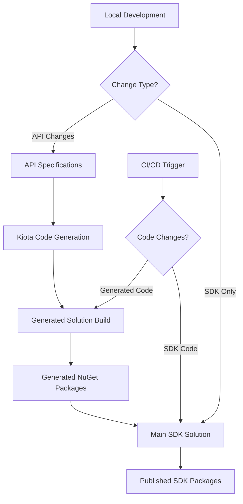

# Generated Code Solution Migration Plan

## Executive Summary

The Procore SDK is experiencing severe build performance issues due to the massive scale of Kiota-generated code (21,521 files, 2+ million lines). Current builds take 10+ minutes when targeting sub-30-second builds for optimal developer experience. This plan outlines a comprehensive migration strategy to separate Kiota-generated code into its own solution, implementing a multi-solution architecture that builds generated code independently and packages it as NuGet packages.

### Key Benefits
- **🚀 Build Performance**: Target 90%+ build time reduction (10+ min → 30s)
- **⚡ Developer Experience**: Near-instant incremental builds for SDK development
- **🔧 Maintainability**: Clear separation between generated and hand-written code
- **📦 Distribution**: Flexible packaging strategy with independent versioning
- **🔄 CI/CD Efficiency**: Parallel build pipelines with intelligent caching

### Success Metrics
- Main SDK solution builds in <30 seconds (clean)
- Generated code solution builds in <5 minutes (acceptable for infrequent updates)
- CI/CD pipeline completes in <10 minutes total
- Developer feedback loop <5 seconds for incremental changes

## Technical Architecture

### Current Architecture Issues

**Build Performance Analysis**:
```
Current State (Single Solution):
├── Main SDK Projects (~150MB source)
├── Generated Code (~151MB, 21,521 files)
│   ├── ProjectManagement (89MB, ~12,600 files) 🔥 CRITICAL
│   ├── Core (40MB, ~5,800 files) 🔥 HIGH IMPACT  
│   ├── QualitySafety (15MB, ~2,000 files) ⚠️ MEDIUM
│   └── Other clients (7MB total)
└── Build Time: 10+ minutes (unacceptable)
```

### Target Architecture (Multi-Solution)

```
Solution 1: Procore.SDK.Generated (Infrequent builds)
├── Procore.SDK.Generated.Core
├── Procore.SDK.Generated.ProjectManagement  
├── Procore.SDK.Generated.QualitySafety
├── Procore.SDK.Generated.ConstructionFinancials
├── Procore.SDK.Generated.FieldProductivity
├── Procore.SDK.Generated.ResourceManagement
└── Build Output: NuGet packages

Solution 2: Procore.SDK.Main (Frequent builds)
├── Procore.SDK (Meta-package, references generated NuGet packages)
├── Procore.SDK.Shared (Authentication, utilities)
├── Client wrappers (Thin wrappers around generated clients)
├── Tests (Integration and unit tests)
└── Build Time: <30 seconds
```

### Dependency Flow Architecture



## Migration Phases

### Phase 1: Foundation Setup (Week 1)
**Objective**: Establish multi-solution structure and build infrastructure

#### 1.1 Create Generated Code Solution
- Create new solution: `Procore.SDK.Generated.sln`
- Establish project structure with consistent naming conventions
- Configure MSBuild properties for generated code optimization
- Set up build performance optimizations (parallel compilation, analyzer exclusions)

#### 1.2 Configure NuGet Package Generation
- Design package metadata strategy with proper versioning
- Implement Central Package Management (CPM) with `Directory.Packages.props`
- Configure package generation with proper dependencies and metadata
- Set up package validation and quality gates

#### 1.3 CI/CD Pipeline Foundation
- Create dedicated build pipeline for generated code solution
- Implement build caching strategies for generated code
- Configure artifact publishing to package feed
- Set up build triggers based on API specification changes

### Phase 2: Generated Code Migration (Week 2)  
**Objective**: Move Kiota-generated projects to new solution

#### 2.1 Move ProjectManagement Client (Highest Impact)
- Extract `Procore.SDK.ProjectManagement/Generated` folder
- Create `Procore.SDK.Generated.ProjectManagement` project
- Configure Kiota generation targets and build properties
- Implement package generation with proper metadata

#### 2.2 Move Core Client (High Impact)
- Extract `Procore.SDK.Core/Generated` folder  
- Create `Procore.SDK.Generated.Core` project
- Configure build optimizations for large codebase
- Validate package generation and dependencies

#### 2.3 Move Remaining Clients
- Extract generated code from QualitySafety, ConstructionFinancials, FieldProductivity, ResourceManagement
- Create corresponding generated projects
- Ensure consistent build configuration across all projects
- Validate complete generated solution builds successfully

### Phase 3: SDK Solution Refactoring (Week 3)
**Objective**: Update main SDK solution to consume generated NuGet packages

#### 3.1 Update Project References
- Replace project references with NuGet package references
- Update `Procore.SDK.Shared` to reference generated packages
- Modify client wrapper projects to consume generated packages
- Ensure proper version constraints and dependency management

#### 3.2 Build Configuration Updates
- Remove generated code from main solution projects
- Update MSBuild targets to exclude generated folders
- Configure package restore for generated dependencies
- Optimize build settings for SDK-only compilation

#### 3.3 Testing Infrastructure Updates  
- Update test projects to reference generated packages
- Modify integration tests to work with packaged dependencies
- Ensure test coverage maintains current levels
- Validate all existing functionality works correctly

### Phase 4: CI/CD Integration (Week 4)
**Objective**: Implement complete automated build and deployment pipeline

#### 4.1 Generated Code Pipeline
- Implement automated Kiota code generation triggers
- Configure conditional builds based on API specification changes
- Set up package versioning strategy (semantic versioning)
- Implement package validation and quality gates

#### 4.2 Main SDK Pipeline
- Update main pipeline to consume latest generated packages
- Implement intelligent dependency resolution
- Configure parallel build execution with generated pipeline
- Set up integration testing with packaged dependencies

#### 4.3 Release Orchestration
- Implement coordinated release process between solutions
- Configure automated dependency updates
- Set up rollback procedures for failed deployments
- Implement comprehensive monitoring and alerting

## Detailed Task Lists

### Phase 1 Tasks: Foundation Setup

#### Task 1.1.1: Create Generated Solution Structure
**Assigned to**: `implementation-engineer`
**Priority**: High
**Dependencies**: None

**Implementation Steps**:
1. Create new directory: `src/Generated/`
2. Create solution file: `src/Generated/Procore.SDK.Generated.sln`
3. Create `Directory.Build.props` with shared MSBuild properties:
   ```xml
   <Project>
     <PropertyGroup>
       <TargetFramework>net6.0</TargetFramework>
       <LangVersion>latest</LangVersion>
       <Nullable>enable</Nullable>
       <GeneratePackageOnBuild>true</GeneratePackageOnBuild>
       
       <!-- Performance Optimizations -->
       <RestoreParallel>true</RestoreParallel>
       <BuildInParallel>true</BuildInParallel>
       <MultiProcessorCompilation>true</MultiProcessorCompilation>
       <UseIncrementalCompilation>true</UseIncrementalCompilation>
       
       <!-- Generated Code Optimizations -->
       <SkipAnalyzersOnGeneratedCode>true</SkipAnalyzersOnGeneratedCode>
       <AnalysisLevel>latest-minimum</AnalysisLevel>
       <RunAnalyzersDuringLiveAnalysis>false</RunAnalyzersDuringLiveAnalysis>
     </PropertyGroup>
   </Project>
   ```

4. Create `Directory.Packages.props` for central package management:
   ```xml
   <Project>
     <PropertyGroup>
       <ManagePackageVersionsCentrally>true</ManagePackageVersionsCentrally>
     </PropertyGroup>
     
     <ItemGroup>
       <PackageVersion Include="Microsoft.Kiota.Abstractions" Version="1.12.0" />
       <PackageVersion Include="Microsoft.Kiota.Http.HttpClientLibrary" Version="1.12.0" />
       <PackageVersion Include="Microsoft.Kiota.Serialization.Form" Version="1.12.0" />
       <PackageVersion Include="Microsoft.Kiota.Serialization.Json" Version="1.12.0" />
       <PackageVersion Include="Microsoft.Kiota.Serialization.Text" Version="1.12.0" />
       <PackageVersion Include="Microsoft.Kiota.Serialization.Multipart" Version="1.12.0" />
     </ItemGroup>
   </Project>
   ```

**Validation Criteria**:
- Solution builds successfully with no projects
- MSBuild properties are correctly inherited
- Central Package Management is functional

**Rollback**: Delete `src/Generated/` directory

#### Task 1.1.2: Configure Package Metadata Template
**Assigned to**: `implementation-engineer`  
**Priority**: High
**Dependencies**: Task 1.1.1

**Implementation Steps**:
1. Create shared package metadata in `Directory.Build.props`:
   ```xml
   <PropertyGroup>
     <PackageId>$(AssemblyName)</PackageId>
     <PackageVersion>1.0.0-preview.1</PackageVersion>
     <Authors>Procore Technologies</Authors>
     <Company>Procore Technologies</Company>
     <Product>Procore SDK</Product>
     <Description>Generated API clients for Procore REST API</Description>
     <Copyright>Copyright © Procore Technologies</Copyright>
     <PackageProjectUrl>https://github.com/procore/procore-sdk-dotnet</PackageProjectUrl>
     <RepositoryUrl>https://github.com/procore/procore-sdk-dotnet</RepositoryUrl>
     <RepositoryType>git</RepositoryType>
     <PackageTags>procore;api;rest;client;generated;kiota</PackageTags>
     <PackageReadmeFile>README.md</PackageReadmeFile>
     <PackageLicenseExpression>MIT</PackageLicenseExpression>
   </PropertyGroup>
   ```

2. Create template README.md for generated packages
3. Configure semantic versioning strategy
4. Set up package validation rules

**Validation Criteria**:
- Package metadata generates correctly
- Version numbering follows semantic versioning
- All required package fields are populated

#### Task 1.1.3: Setup CI/CD Pipeline Foundation
**Assigned to**: `implementation-engineer`
**Priority**: High  
**Dependencies**: Task 1.1.2

**Implementation Steps**:
1. Create `.github/workflows/generated-code.yml`:
   ```yaml
   name: Generated Code Build
   
   on:
     push:
       paths:
         - 'src/Generated/**'
         - 'api-specs/**'
     pull_request:
       paths:
         - 'src/Generated/**'
         - 'api-specs/**'
   
   jobs:
     build-generated:
       runs-on: ubuntu-latest
       timeout-minutes: 20
       
       steps:
       - uses: actions/checkout@v4
       
       - name: Setup .NET
         uses: actions/setup-dotnet@v4
         with:
           dotnet-version: '6.0.x'
           
       - name: Cache NuGet packages
         uses: actions/cache@v3
         with:
           path: ~/.nuget/packages
           key: nuget-generated-${{ hashFiles('src/Generated/**/*.csproj') }}
           
       - name: Restore dependencies
         run: dotnet restore src/Generated/
         
       - name: Build solution
         run: dotnet build src/Generated/ --no-restore --configuration Release
         
       - name: Run tests
         run: dotnet test src/Generated/ --no-build --configuration Release
         
       - name: Pack packages
         run: dotnet pack src/Generated/ --no-build --configuration Release --output ./packages
         
       - name: Upload packages
         uses: actions/upload-artifact@v3
         with:
           name: generated-packages
           path: ./packages/*.nupkg
   ```

2. Configure build caching strategies
3. Set up artifact management
4. Configure build notifications

**Validation Criteria**:
- Pipeline runs successfully with empty solution
- Artifacts are properly generated and uploaded
- Build caching works correctly

### Phase 2 Tasks: Generated Code Migration

#### Task 2.1.1: Extract ProjectManagement Generated Code
**Assigned to**: `implementation-engineer`
**Priority**: Critical
**Dependencies**: Phase 1 completion

**Implementation Steps**:
1. Create new project: `src/Generated/Procore.SDK.Generated.ProjectManagement/`
2. Create project file with optimized settings:
   ```xml
   <Project Sdk="Microsoft.NET.Sdk">
     <PropertyGroup>
       <PackageId>Procore.SDK.Generated.ProjectManagement</PackageId>
       <Description>Generated API client for Procore Project Management APIs</Description>
       <AssemblyName>Procore.SDK.Generated.ProjectManagement</AssemblyName>
       <RootNamespace>Procore.SDK.Generated.ProjectManagement</RootNamespace>
     </PropertyGroup>

     <ItemGroup>
       <PackageReference Include="Microsoft.Kiota.Abstractions" />
       <PackageReference Include="Microsoft.Kiota.Http.HttpClientLibrary" />
       <PackageReference Include="Microsoft.Kiota.Serialization.Form" />
       <PackageReference Include="Microsoft.Kiota.Serialization.Json" />
       <PackageReference Include="Microsoft.Kiota.Serialization.Text" />
       <PackageReference Include="Microsoft.Kiota.Serialization.Multipart" />
     </ItemGroup>
   </Project>
   ```

3. Move generated code from `src/Procore.SDK.ProjectManagement/Generated/` to new project
4. Update namespaces to match new project structure
5. Configure Kiota generation targets if needed
6. Add to generated solution: `dotnet sln src/Generated/Procore.SDK.Generated.sln add src/Generated/Procore.SDK.Generated.ProjectManagement/`

**Validation Criteria**:
- Project builds successfully in isolation
- Generated code compiles without errors
- Package generates with correct metadata
- Build time for this project alone is <2 minutes

**Rollback**: 
- Restore generated code to original location
- Remove generated project and solution reference

#### Task 2.1.2: Extract Core Generated Code  
**Assigned to**: `implementation-engineer`
**Priority**: Critical
**Dependencies**: Task 2.1.1 completion

**Implementation Steps**:
1. Create new project: `src/Generated/Procore.SDK.Generated.Core/`
2. Create project file similar to ProjectManagement
3. Move generated code from `src/Procore.SDK.Core/Generated/`
4. Update namespaces and project references
5. Add to generated solution
6. Validate build performance

**Validation Criteria**:
- Project builds successfully
- Core client functionality is preserved
- Package dependencies are correct
- Combined build time for both projects <4 minutes

#### Task 2.1.3: Extract Remaining Generated Clients
**Assigned to**: `implementation-engineer`
**Priority**: High
**Dependencies**: Task 2.1.2 completion

**Implementation Steps**:
1. Create projects for:
   - `Procore.SDK.Generated.QualitySafety`
   - `Procore.SDK.Generated.ConstructionFinancials` 
   - `Procore.SDK.Generated.FieldProductivity`
   - `Procore.SDK.Generated.ResourceManagement`

2. Move respective generated code
3. Configure project files and dependencies
4. Add all projects to generated solution
5. Validate complete solution builds

**Validation Criteria**:
- All generated projects build successfully
- Complete generated solution builds in <5 minutes
- All packages generate correctly
- No compilation errors or warnings

### Phase 3 Tasks: SDK Solution Refactoring

#### Task 3.1.1: Update Shared Project Dependencies
**Assigned to**: `implementation-engineer`
**Priority**: High
**Dependencies**: Phase 2 completion

**Implementation Steps**:
1. Update `src/Procore.SDK.Shared/Procore.SDK.Shared.csproj`:
   ```xml
   <Project Sdk="Microsoft.NET.Sdk">
     <!-- Remove generated code project references -->
     <!-- Add NuGet package references -->
     <ItemGroup>
       <PackageReference Include="Procore.SDK.Generated.Core" Version="1.0.0-preview.1" />
       <PackageReference Include="Procore.SDK.Generated.ProjectManagement" Version="1.0.0-preview.1" />
       <PackageReference Include="Procore.SDK.Generated.QualitySafety" Version="1.0.0-preview.1" />
       <PackageReference Include="Procore.SDK.Generated.ConstructionFinancials" Version="1.0.0-preview.1" />
       <PackageReference Include="Procore.SDK.Generated.FieldProductivity" Version="1.0.0-preview.1" />
       <PackageReference Include="Procore.SDK.Generated.ResourceManagement" Version="1.0.0-preview.1" />
     </ItemGroup>
   </Project>
   ```

2. Update using statements in shared code to reference new namespaces
3. Configure local package source for development
4. Validate authentication and common utilities work with packaged dependencies

**Validation Criteria**:
- Shared project builds with NuGet dependencies
- No compilation errors after namespace updates
- Authentication functionality preserved
- Local package resolution works correctly

#### Task 3.1.2: Update Client Wrapper Projects
**Assigned to**: `implementation-engineer`
**Priority**: High  
**Dependencies**: Task 3.1.1

**Implementation Steps**:
1. Update each client project (Core, ProjectManagement, etc.) to:
   - Remove generated folder references
   - Add corresponding generated package reference
   - Update using statements and namespaces
   - Validate wrapper functionality

2. Example for `src/Procore.SDK.Core/Procore.SDK.Core.csproj`:
   ```xml
   <Project Sdk="Microsoft.NET.Sdk">
     <ItemGroup>
       <ProjectReference Include="../Procore.SDK.Shared/Procore.SDK.Shared.csproj" />
       <PackageReference Include="Procore.SDK.Generated.Core" Version="1.0.0-preview.1" />
     </ItemGroup>
   </Project>
   ```

3. Update client wrapper classes to import from generated packages
4. Validate all client functionality works correctly

**Validation Criteria**:
- All client projects build successfully  
- Wrapper functionality is preserved
- Integration with shared project works
- No missing dependencies or namespace issues

#### Task 3.1.3: Update Meta-Package Project
**Assigned to**: `implementation-engineer`
**Priority**: Medium
**Dependencies**: Task 3.1.2

**Implementation Steps**:
1. Update `src/Procore.SDK/Procore.SDK.csproj` to reference client projects
2. Ensure meta-package includes all necessary dependencies
3. Validate package generation includes all sub-packages
4. Test meta-package installation and usage

**Validation Criteria**:
- Meta-package includes all client dependencies
- Package installation works correctly
- All client functionality available through meta-package

### Phase 4 Tasks: CI/CD Integration

#### Task 4.1.1: Generated Code Build Pipeline
**Assigned to**: `implementation-engineer`
**Priority**: High
**Dependencies**: Phase 3 completion

**Implementation Steps**:
1. Complete generated code pipeline configuration
2. Implement semantic versioning based on changes
3. Configure package publishing to feed
4. Set up build triggers based on API specification changes

**Validation Criteria**:
- Pipeline builds and publishes packages automatically
- Version numbering works correctly
- Packages are available for consumption

#### Task 4.1.2: Main SDK Pipeline Updates
**Assigned to**: `implementation-engineer`
**Priority**: High
**Dependencies**: Task 4.1.1

**Implementation Steps**:
1. Update main SDK pipeline to:
   - Use latest generated packages
   - Build in <30 seconds for SDK changes
   - Run all tests successfully
   - Publish SDK packages

2. Configure dependency resolution and version management
3. Set up integration testing with generated packages

**Validation Criteria**:
- Main SDK builds in <30 seconds
- All tests pass with packaged dependencies
- SDK packages publish successfully

#### Task 4.1.3: Release Orchestration
**Assigned to**: `implementation-engineer`
**Priority**: Medium
**Dependencies**: Task 4.1.2

**Implementation Steps**:
1. Implement coordinated release process
2. Configure automated dependency updates
3. Set up monitoring and alerting
4. Create rollback procedures

**Validation Criteria**:
- Coordinated releases work correctly
- Dependency updates are automated
- Monitoring provides adequate visibility

## CI/CD Pipeline Design

### Generated Code Pipeline

```yaml
name: Generated Code Build and Publish

trigger:
  branches:
    include: [main, develop]
  paths:
    include: 
      - src/Generated/**
      - api-specs/**

variables:
  - name: solution
    value: 'src/Generated/Procore.SDK.Generated.sln'
  - name: buildConfiguration  
    value: 'Release'

stages:
- stage: Build
  displayName: 'Build Generated Code'
  jobs:
  - job: BuildAndTest
    displayName: 'Build and Test'
    pool:
      vmImage: 'ubuntu-latest'
    timeoutInMinutes: 30
    
    steps:
    - checkout: self
      fetchDepth: 1
      
    - task: UseDotNet@2
      displayName: 'Setup .NET SDK'
      inputs:
        packageType: 'sdk'
        version: '6.0.x'
        
    - task: Cache@2
      displayName: 'Cache NuGet packages'
      inputs:
        key: 'nuget-generated | $(Agent.OS) | **/packages.lock.json'
        path: '~/.nuget/packages'
        
    - task: DotNetCoreCLI@2
      displayName: 'Restore packages'
      inputs:
        command: 'restore'
        projects: '$(solution)'
        feedsToUse: 'select'
        includeNuGetOrg: true
        
    - task: DotNetCoreCLI@2
      displayName: 'Build solution'
      inputs:
        command: 'build'
        projects: '$(solution)'
        arguments: '--no-restore --configuration $(buildConfiguration) --parallel'
        
    - task: DotNetCoreCLI@2
      displayName: 'Run tests'
      inputs:
        command: 'test'
        projects: '$(solution)'
        arguments: '--no-build --configuration $(buildConfiguration) --collect:"XPlat Code Coverage"'
        publishTestResults: true
        
    - task: DotNetCoreCLI@2  
      displayName: 'Pack packages'
      inputs:
        command: 'pack'
        projects: '$(solution)'
        arguments: '--no-build --configuration $(buildConfiguration) --output $(Build.ArtifactStagingDirectory)'
        
    - task: PublishBuildArtifacts@1
      displayName: 'Publish packages'
      inputs:
        pathtoPublish: '$(Build.ArtifactStagingDirectory)'
        artifactName: 'generated-packages'

- stage: Publish
  displayName: 'Publish Packages'
  condition: and(succeeded(), eq(variables['Build.SourceBranch'], 'refs/heads/main'))
  dependsOn: Build
  jobs:
  - deployment: PublishToFeed
    displayName: 'Publish to NuGet Feed'
    environment: 'package-feed'
    strategy:
      runOnce:
        deploy:  
          steps:
          - task: NuGetCommand@2
            displayName: 'Push packages'
            inputs:
              command: 'push'
              packagesToPush: '$(Pipeline.Workspace)/**/*.nupkg'
              nuGetFeedType: 'internal'
              publishVstsFeed: 'procore-sdk-generated'
```

### Main SDK Pipeline

```yaml
name: Main SDK Build and Publish

trigger:
  branches:
    include: [main, develop]
  paths:
    exclude: 
      - src/Generated/**
      - api-specs/**

variables:
  - name: solution
    value: 'Procore.SDK.sln'
  - name: buildConfiguration
    value: 'Release'

stages:
- stage: Build
  displayName: 'Build SDK'
  jobs:
  - job: BuildAndTest
    displayName: 'Build and Test SDK'
    pool:
      vmImage: 'ubuntu-latest'
    timeoutInMinutes: 15  # Target: <15 minutes total
    
    steps:
    - checkout: self
      fetchDepth: 1
      
    - task: UseDotNet@2
      displayName: 'Setup .NET SDK'
      inputs:
        packageType: 'sdk'
        version: '6.0.x'
        
    - task: Cache@2
      displayName: 'Cache NuGet packages'  
      inputs:
        key: 'nuget-sdk | $(Agent.OS) | **/packages.lock.json'
        path: '~/.nuget/packages'
        
    - task: DotNetCoreCLI@2
      displayName: 'Restore packages'
      inputs:
        command: 'restore'
        projects: '$(solution)'
        feedsToUse: 'select'
        includeNuGetOrg: true
        vstsFeed: 'procore-sdk-generated'  # Include generated packages feed
        
    - task: DotNetCoreCLI@2
      displayName: 'Build solution'  
      inputs:
        command: 'build'
        projects: '$(solution)'
        arguments: '--no-restore --configuration $(buildConfiguration) --parallel'
        
    - task: DotNetCoreCLI@2
      displayName: 'Run tests'
      inputs:
        command: 'test' 
        projects: '$(solution)'
        arguments: '--no-build --configuration $(buildConfiguration) --collect:"XPlat Code Coverage" --settings coverlet.runsettings'
        publishTestResults: true
        
    - task: PublishCodeCoverageResults@1
      displayName: 'Publish coverage'
      inputs:
        codeCoverageTool: 'Cobertura'
        summaryFileLocation: '$(Agent.TempDirectory)/**/*coverage.cobertura.xml'
        
    - task: DotNetCoreCLI@2
      displayName: 'Pack SDK packages'
      inputs:
        command: 'pack'
        projects: '$(solution)'
        arguments: '--no-build --configuration $(buildConfiguration) --output $(Build.ArtifactStagingDirectory)'
        
    - task: PublishBuildArtifacts@1
      displayName: 'Publish SDK packages'
      inputs:
        pathtoPublish: '$(Build.ArtifactStagingDirectory)'
        artifactName: 'sdk-packages'

- stage: Publish
  displayName: 'Publish SDK'
  condition: and(succeeded(), eq(variables['Build.SourceBranch'], 'refs/heads/main'))
  dependsOn: Build
  jobs:
  - deployment: PublishToNuGet
    displayName: 'Publish to NuGet.org'
    environment: 'nuget-org'
    strategy:
      runOnce:
        deploy:
          steps:
          - task: NuGetCommand@2
            displayName: 'Push to NuGet.org'
            inputs:
              command: 'push'
              packagesToPush: '$(Pipeline.Workspace)/**/*.nupkg'
              nuGetFeedType: 'external'
              publishFeedCredentials: 'NuGet.org'
```

### Pipeline Orchestration Strategy

**Parallel Execution**:
- Generated code pipeline runs independently when API specs change
- Main SDK pipeline runs for all other changes
- Both pipelines can run in parallel when changes affect both

**Dependency Management**:
- Main SDK pipeline consumes latest stable generated packages by default
- Pre-release generated packages available for testing API changes
- Automatic dependency updates through Dependabot or similar

**Build Performance Targets**:
- Generated code pipeline: <20 minutes (acceptable for infrequent runs)
- Main SDK pipeline: <10 minutes total (<30 seconds build + tests)
- Parallel execution enables <15 minutes total cycle time

## Risk Analysis

### High Risk Items

#### Risk 1: Generated Package Versioning Complexity
**Probability**: High | **Impact**: Medium
**Description**: Managing semantic versioning across multiple generated packages while maintaining API compatibility

**Mitigation Strategies**:
- Implement automated semantic versioning based on API specification changes
- Use preview/beta channels for testing breaking changes
- Maintain compatibility matrices between SDK and generated package versions
- Implement automated compatibility testing

**Detection**: 
- Monitor for breaking changes in API specifications
- Automated testing of all version combinations
- User feedback on compatibility issues

**Rollback Plan**:
- Maintain previous package versions in feed
- Implement automated rollback to last known good versions
- Clear communication of supported version combinations

#### Risk 2: Build Cache Invalidation
**Probability**: Medium | **Impact**: High  
**Description**: Generated code changes causing frequent cache invalidation, reducing build performance benefits

**Mitigation Strategies**:
- Implement intelligent cache partitioning by project
- Use content-based cache keys instead of timestamp-based
- Implement distributed caching for shared CI/CD environments
- Monitor cache hit rates and optimize cache strategies

**Detection**:
- Monitor build times and cache hit rates
- Alert on cache performance degradation
- Track build performance metrics over time

**Rollback Plan**:
- Disable caching temporarily if causing issues  
- Fallback to full builds with performance monitoring
- Gradual re-enablement of caching with monitoring

#### Risk 3: Dependency Resolution Conflicts
**Probability**: Medium | **Impact**: High
**Description**: Version conflicts between generated packages and main SDK dependencies

**Mitigation Strategies**:
- Use Central Package Management (CPM) for version consistency
- Implement automated dependency conflict detection
- Maintain compatibility testing across dependency combinations
- Use floating version ranges carefully with proper constraints

**Detection**:
- Automated dependency analysis in CI/CD
- Runtime dependency conflict monitoring
- User-reported issues with package installation

**Rollback Plan**:
- Pin specific working versions temporarily
- Implement hotfix releases for critical conflicts
- Clear documentation of known conflicts and workarounds

### Medium Risk Items

#### Risk 4: Local Development Environment Issues
**Probability**: High | **Impact**: Low
**Description**: Developers needing to work with both solutions simultaneously

**Mitigation Strategies**:
- Provide clear development workflow documentation
- Create developer tooling for local package management
- Implement local package feed setup scripts
- Provide development Docker containers with pre-configured environment

#### Risk 5: CI/CD Pipeline Complexity
**Probability**: Medium | **Impact**: Medium
**Description**: Increased complexity in build orchestration and failure diagnosis

**Mitigation Strategies**:
- Implement comprehensive monitoring and alerting
- Provide clear runbooks for pipeline failures
- Implement automated pipeline health checks
- Maintain simple rollback procedures

### Low Risk Items

#### Risk 6: Package Feed Availability
**Probability**: Low | **Impact**: High
**Description**: Package feed outages affecting builds

**Mitigation Strategies**:
- Use multiple package feed mirrors
- Implement offline package caching
- Maintain emergency build procedures
- Monitor package feed health

## Success Criteria

### Performance Metrics

**Build Performance**:
- ✅ Main SDK solution: Clean build <30 seconds (Target: 90%+ improvement)
- ✅ Main SDK solution: Incremental build <5 seconds
- ✅ Generated code solution: Build <20 minutes (acceptable for infrequent updates)
- ✅ Complete CI/CD pipeline: <15 minutes total

**Developer Experience**:
- ✅ Code-to-feedback loop: <5 seconds for incremental changes
- ✅ Local development setup: <5 minutes from clone to build
- ✅ IDE responsiveness: No performance degradation with separated solutions
- ✅ Test execution: <2 minutes for full test suite

**Quality Metrics**:
- ✅ Code coverage: Maintain current levels (>80%)
- ✅ Build success rate: >95% in CI/CD
- ✅ Package availability: 99.9% uptime
- ✅ Integration test success: >98%

### Functional Validation

**API Compatibility**:
- ✅ All existing SDK functionality preserved
- ✅ No breaking changes in public APIs
- ✅ Authentication and authorization work correctly
- ✅ All client operations function as expected

**Package Management**:
- ✅ Generated packages install correctly
- ✅ Dependency resolution works without conflicts  
- ✅ Version management functions properly
- ✅ Package metadata is complete and accurate

**CI/CD Integration**:
- ✅ Automated builds and deployments work reliably
- ✅ Proper artifact generation and publishing
- ✅ Rollback procedures function correctly
- ✅ Monitoring and alerting provide adequate visibility

### Acceptance Criteria

**Phase 1 Acceptance**:
- [ ] Generated code solution builds successfully
- [ ] Package generation produces valid NuGet packages
- [ ] CI/CD pipeline foundation is operational
- [ ] All build optimizations are configured

**Phase 2 Acceptance**:
- [ ] All generated code successfully moved to new solution
- [ ] Generated solution builds in <20 minutes
- [ ] All generated packages are properly configured
- [ ] No compilation errors in generated projects

**Phase 3 Acceptance**:
- [ ] Main SDK solution builds with NuGet dependencies
- [ ] All client functionality preserved
- [ ] Build time <30 seconds for clean builds
- [ ] All tests pass with packaged dependencies

**Phase 4 Acceptance**:
- [ ] Complete CI/CD pipeline operational
- [ ] Automated package publishing works
- [ ] Monitoring and alerting configured
- [ ] Documentation and runbooks complete

**Final Acceptance**:
- [ ] Performance targets achieved (>90% build time improvement)
- [ ] All functionality validated in production-like environment
- [ ] Developer workflow documented and tested
- [ ] Team training completed
- [ ] Rollback procedures validated

### Success Measurement Plan

**Week 1-2 Metrics**:
- Track foundation setup progress
- Measure initial generated solution build times
- Monitor CI/CD pipeline reliability

**Week 3-4 Metrics**:  
- Measure main SDK build performance improvements
- Track package dependency resolution success rates
- Monitor developer adoption and feedback

**Week 5-8 Metrics**:
- Long-term build performance stability
- Package update frequency and success rates
- Developer productivity metrics
- CI/CD pipeline efficiency

**Ongoing Monitoring**:
- Daily build performance tracking
- Weekly package feed health reports
- Monthly developer experience surveys
- Quarterly architecture review and optimization

This comprehensive migration plan provides a structured approach to separating Kiota-generated code into its own solution, achieving the target build performance improvements while maintaining all existing functionality and providing a robust foundation for future development.