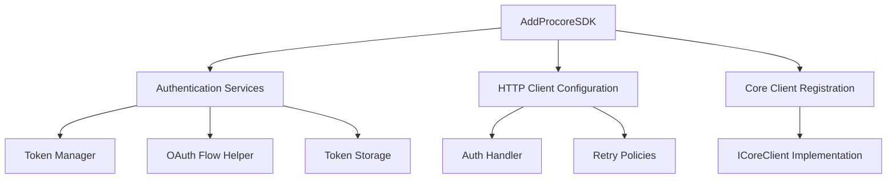

# Procore SDK Dependency Injection Configuration Guide

## Overview

This guide demonstrates proper dependency injection (DI) configuration for the Procore SDK in both console and web applications. The Procore SDK provides extension methods to simplify service registration while allowing customization for different application architectures.

## 🏗️ Core Architecture

### Service Registration Flow



## 📋 Console Application Configuration

### Basic Setup

```csharp
using Microsoft.Extensions.Configuration;
using Microsoft.Extensions.DependencyInjection;
using Microsoft.Extensions.Hosting;
using Microsoft.Extensions.Logging;
using Procore.SDK.Extensions;
using Procore.SDK.Shared.Authentication;
using Procore.SDK.Core;

class Program
{
    static async Task Main(string[] args)
    {
        var host = CreateHost();
        var serviceProvider = host.Services;
        
        // Your application logic here
        await RunApplicationAsync(serviceProvider);
    }

    private static IHost CreateHost()
    {
        var configuration = new ConfigurationBuilder()
            .SetBasePath(Directory.GetCurrentDirectory())
            .AddJsonFile("appsettings.json", optional: false, reloadOnChange: true)
            .AddUserSecrets<Program>()  // For development secrets
            .AddEnvironmentVariables() // For production configuration
            .Build();

        return Host.CreateDefaultBuilder()
            .ConfigureServices((context, services) =>
            {
                // Register Procore SDK services
                services.AddProcoreSDK(configuration);
                
                // Configure token storage for console applications
                services.AddSingleton<ITokenStorage, InMemoryTokenStorage>();
                
                // Register Core client for API operations
                services.AddSingleton<ICoreClient, CoreClient>();
                
                // Optional: Add custom services
                services.AddTransient<IYourCustomService, YourCustomService>();
            })
            .ConfigureLogging(logging =>
            {
                logging.ClearProviders();
                logging.AddConsole();
                logging.SetMinimumLevel(LogLevel.Information);
            })
            .Build();
    }
}
```

### Configuration File Structure

**appsettings.json**:
```json
{
  "Logging": {
    "LogLevel": {
      "Default": "Information",
      "Microsoft": "Warning",
      "Microsoft.Hosting.Lifetime": "Information"
    }
  },
  "ProcoreAuth": {
    "ClientId": "YOUR_CLIENT_ID",
    "ClientSecret": "YOUR_CLIENT_SECRET",
    "RedirectUri": "http://localhost:8080/oauth/callback",
    "Scopes": ["read", "write"],
    "AuthorizationEndpoint": "https://app.procore.com/oauth/authorize",
    "TokenEndpoint": "https://api.procore.com/oauth/token",
    "TokenRefreshMargin": "00:05:00",
    "UsePkce": true
  }
}
```

### User Secrets Setup (Development)

```bash
# Initialize user secrets
dotnet user-secrets init

# Set OAuth credentials (never commit these!)
dotnet user-secrets set "ProcoreAuth:ClientId" "your-actual-client-id"
dotnet user-secrets set "ProcoreAuth:ClientSecret" "your-actual-client-secret"
```

## 🌐 Web Application Configuration

### ASP.NET Core Setup

```csharp
using Microsoft.AspNetCore.Authentication.Cookies;
using Procore.SDK.Extensions;
using Procore.SDK.Shared.Authentication;
using Procore.SDK.Core;
using WebSample.Services;

namespace WebSample;

public class Program
{
    public static void Main(string[] args)
    {
        var builder = WebApplication.CreateBuilder(args);
        
        ConfigureServices(builder.Services, builder.Configuration);
        
        var app = builder.Build();
        
        ConfigurePipeline(app);
        
        app.Run();
    }

    private static void ConfigureServices(IServiceCollection services, IConfiguration configuration)
    {
        // Add MVC services
        services.AddControllersWithViews();

        // Add session services for token storage
        services.AddMemoryCache();
        services.AddDistributedMemoryCache();
        services.AddSession(options =>
        {
            options.IdleTimeout = TimeSpan.FromMinutes(30);
            options.Cookie.HttpOnly = true;
            options.Cookie.IsEssential = true;
            options.Cookie.SecurePolicy = CookieSecurePolicy.SameAsRequest;
            options.Cookie.SameSite = SameSiteMode.Lax;
        });

        // Register Procore SDK services
        services.AddProcoreSDK(configuration);

        // Configure token storage for web applications
        services.AddScoped<ITokenStorage, SessionTokenStorage>();

        // Register Core client with scoped lifetime for web apps
        services.AddScoped<ICoreClient, CoreClient>();

        // Add HTTP context accessor for session access
        services.AddHttpContextAccessor();

        // Add application services
        services.AddScoped<AuthenticationService>();
        services.AddScoped<ProjectService>();

        // Configure authentication
        services.AddAuthentication(CookieAuthenticationDefaults.AuthenticationScheme)
            .AddCookie(options =>
            {
                options.LoginPath = "/Auth/Login";
                options.LogoutPath = "/Auth/Logout";
                options.AccessDeniedPath = "/Auth/AccessDenied";
                options.ExpireTimeSpan = TimeSpan.FromHours(1);
                options.SlidingExpiration = true;
                options.Cookie.HttpOnly = true;
                options.Cookie.SecurePolicy = CookieSecurePolicy.SameAsRequest;
            });

        // Add authorization
        services.AddAuthorization();

        // Configure logging
        services.AddLogging(logging =>
        {
            logging.AddConsole();
            logging.AddDebug();
            if (builder.Environment.IsDevelopment())
            {
                logging.SetMinimumLevel(LogLevel.Debug);
            }
        });
    }

    private static void ConfigurePipeline(WebApplication app)
    {
        // Configure the HTTP request pipeline
        if (!app.Environment.IsDevelopment())
        {
            app.UseExceptionHandler("/Home/Error");
            app.UseHsts();
        }

        app.UseHttpsRedirection();
        app.UseStaticFiles();
        app.UseRouting();

        // Session must come before authentication
        app.UseSession();
        
        app.UseAuthentication();
        app.UseAuthorization();

        app.MapControllerRoute(
            name: "default",
            pattern: "{controller=Home}/{action=Index}/{id?}");
    }
}
```

## 🔧 Service Lifetimes

### Understanding Service Scopes

| Service | Console Lifetime | Web Lifetime | Reason |
|---------|------------------|--------------|---------|
| `ITokenStorage` | Singleton | Scoped | Console needs persistent storage across operations; Web needs per-request isolation |
| `ICoreClient` | Singleton | Scoped | Console can reuse; Web needs per-request to avoid thread safety issues |
| `ITokenManager` | Singleton | Scoped | Registered automatically by AddProcoreSDK |
| `OAuthFlowHelper` | Singleton | Singleton | Stateless service can be shared |
| `AuthenticationService` | N/A | Scoped | Web-specific service for managing authentication state |
| `ProjectService` | Transient | Scoped | Business logic service |

### Why Different Lifetimes?

**Console Applications**:
- Long-running process with single-user context
- Token storage needs to persist across multiple operations
- Singleton services reduce memory allocation

**Web Applications**:
- Multi-user, multi-request environment
- Each request needs isolated token storage
- Scoped services ensure proper isolation between users

## 🔒 Token Storage Strategies

### Console Application: InMemoryTokenStorage

```csharp
services.AddSingleton<ITokenStorage, InMemoryTokenStorage>();
```

**Characteristics**:
- Stores tokens in memory during application lifetime
- Tokens lost when application terminates
- Suitable for short-lived console applications
- Thread-safe for single-user scenarios

### Console Application: FileTokenStorage (Alternative)

```csharp
services.AddSingleton<ITokenStorage, FileTokenStorage>();
```

**Characteristics**:
- Persists tokens to encrypted file
- Tokens survive application restarts
- Suitable for long-running console applications
- Automatic cleanup of expired tokens

### Web Application: SessionTokenStorage

```csharp
services.AddScoped<ITokenStorage, SessionTokenStorage>();
services.AddHttpContextAccessor(); // Required dependency
```

**Characteristics**:
- Stores tokens in user session
- Automatic isolation between users
- Tokens cleared when session expires
- Memory cache fallback for reliability

## ⚙️ Advanced Configuration Options

### Custom Token Storage

```csharp
// Custom database token storage
public class DatabaseTokenStorage : ITokenStorage
{
    private readonly IDbContext _context;
    private readonly IHttpContextAccessor _httpContextAccessor;
    
    public DatabaseTokenStorage(IDbContext context, IHttpContextAccessor httpContextAccessor)
    {
        _context = context;
        _httpContextAccessor = httpContextAccessor;
    }
    
    public async Task<AccessToken?> GetTokenAsync(CancellationToken cancellationToken = default)
    {
        var userId = GetCurrentUserId();
        var tokenEntity = await _context.UserTokens
            .FirstOrDefaultAsync(t => t.UserId == userId && t.ExpiresAt > DateTime.UtcNow);
            
        return tokenEntity?.ToAccessToken();
    }
    
    // Implement other interface methods...
}

// Registration
services.AddScoped<ITokenStorage, DatabaseTokenStorage>();
```

### Custom HTTP Client Configuration

```csharp
services.AddProcoreSDK(configuration, options =>
{
    // Configure HTTP client
    options.ConfigureHttpClient = (httpClient) =>
    {
        httpClient.Timeout = TimeSpan.FromSeconds(30);
        httpClient.DefaultRequestHeaders.UserAgent.ParseAdd("MyApp/1.0");
    };
    
    // Configure retry policies
    options.EnableRetryPolicy = true;
    options.MaxRetryAttempts = 3;
    options.RetryDelay = TimeSpan.FromSeconds(1);
});
```

### Environment-Specific Configuration

```csharp
// Different configurations per environment
if (builder.Environment.IsDevelopment())
{
    services.AddSingleton<ITokenStorage, InMemoryTokenStorage>();
}
else if (builder.Environment.IsStaging())
{
    services.AddScoped<ITokenStorage, SessionTokenStorage>();
}
else // Production
{
    services.AddScoped<ITokenStorage, DatabaseTokenStorage>();
}
```

## 🧪 Testing Configuration

### Test Service Registration

```csharp
public class TestStartup
{
    public void ConfigureTestServices(IServiceCollection services, IConfiguration configuration)
    {
        // Register Procore SDK with test configuration
        services.AddProcoreSDK(configuration);
        
        // Replace with test implementations
        services.AddScoped<ITokenStorage, TestTokenStorage>();
        services.AddScoped<ICoreClient, MockCoreClient>();
        
        // Add test HTTP client factory
        services.AddSingleton<IHttpClientFactory, TestHttpClientFactory>();
    }
}
```

### Mock Service Implementation

```csharp
public class MockCoreClient : ICoreClient
{
    public Task<IEnumerable<Company>> GetCompaniesAsync(CancellationToken cancellationToken = default)
    {
        // Return mock data for testing
        var mockCompanies = new[]
        {
            new Company { Id = 1, Name = "Test Company" }
        };
        return Task.FromResult<IEnumerable<Company>>(mockCompanies);
    }
    
    // Implement other interface methods...
}
```

## 🔍 Debugging DI Configuration

### Service Resolution Validation

```csharp
public static void ValidateServices(IServiceProvider serviceProvider)
{
    // Validate critical services can be resolved
    var tokenManager = serviceProvider.GetRequiredService<ITokenManager>();
    var coreClient = serviceProvider.GetRequiredService<ICoreClient>();
    var oauthHelper = serviceProvider.GetRequiredService<OAuthFlowHelper>();
    
    Console.WriteLine("✅ All required services registered successfully");
}
```

### Common Configuration Issues

1. **Missing Configuration Section**:
   ```
   InvalidOperationException: Unable to resolve service for type 'IOptions<ProcoreAuthOptions>'
   ```
   **Solution**: Ensure `ProcoreAuth` section exists in configuration

2. **Missing HttpContextAccessor**:
   ```
   InvalidOperationException: Unable to resolve service for type 'IHttpContextAccessor'
   ```
   **Solution**: Add `services.AddHttpContextAccessor()` for web applications

3. **Circular Dependencies**:
   ```
   InvalidOperationException: A circular dependency was detected
   ```
   **Solution**: Review service lifetimes and dependencies

## 📊 Performance Considerations

### Service Lifetime Impact

| Lifetime | Memory Usage | Performance | Thread Safety |
|----------|--------------|-------------|---------------|
| Singleton | Lowest | Highest | Must be thread-safe |
| Scoped | Medium | Medium | Isolated per request |
| Transient | Highest | Lowest | Always safe |

### Recommendations

1. **Console Applications**: Use Singleton for most services
2. **Web Applications**: Use Scoped for most services
3. **Stateless Services**: Can safely be Singleton
4. **Database Contexts**: Should be Scoped in web applications

## 🔐 Security Best Practices

### Configuration Security

```csharp
// Use secure configuration providers
var configuration = new ConfigurationBuilder()
    .AddJsonFile("appsettings.json")
    .AddUserSecrets<Program>()          // Development
    .AddEnvironmentVariables()           // Production
    .AddAzureKeyVault(vaultUrl)         // Production secrets
    .Build();
```

### Token Storage Security

```csharp
// Enable data protection for sensitive data
services.AddDataProtection()
    .PersistKeysToFileSystem(new DirectoryInfo(@"./keys/"))
    .SetApplicationName("ProCoreSDKSample");

// Use protected token storage
services.AddSingleton<ITokenStorage, ProtectedDataTokenStorage>();
```

## 📝 Configuration Validation

### Options Validation

```csharp
services.Configure<ProcoreAuthOptions>(configuration.GetSection("ProcoreAuth"));

services.AddOptions<ProcoreAuthOptions>()
    .Bind(configuration.GetSection("ProcoreAuth"))
    .ValidateDataAnnotations()
    .Validate(options =>
    {
        return !string.IsNullOrEmpty(options.ClientId) && 
               !string.IsNullOrEmpty(options.ClientSecret);
    }, "ClientId and ClientSecret are required");
```

### Startup Validation

```csharp
public void Configure(IApplicationBuilder app, IOptions<ProcoreAuthOptions> authOptions)
{
    // Validate configuration at startup
    var options = authOptions.Value;
    if (string.IsNullOrEmpty(options.ClientId))
    {
        throw new InvalidOperationException("ProcoreAuth:ClientId is required");
    }
    
    // Continue with pipeline configuration...
}
```

This guide provides comprehensive coverage of dependency injection patterns for the Procore SDK, ensuring developers can properly configure their applications for different environments and use cases.